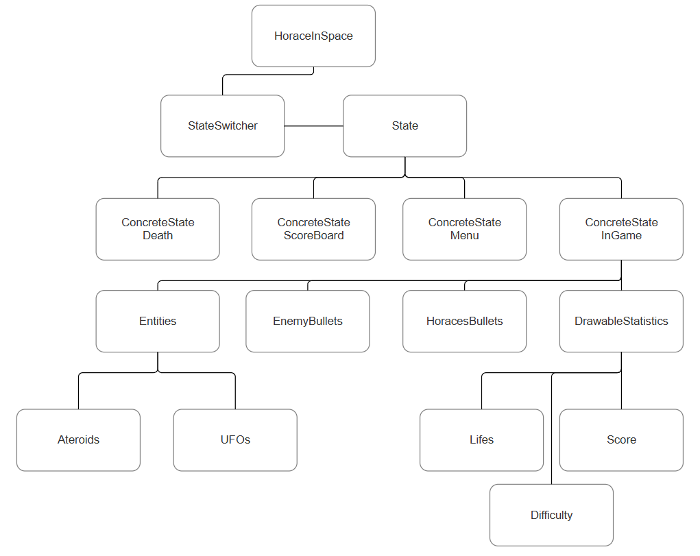
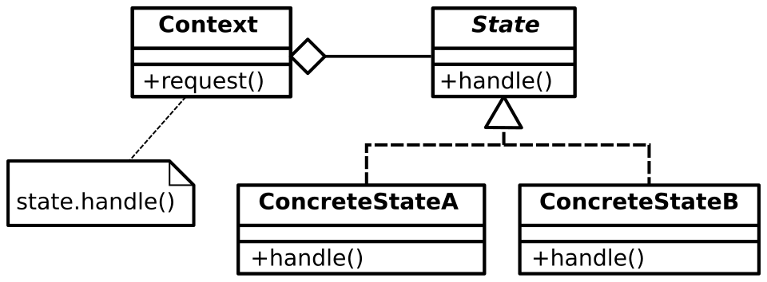

# Developer documentation

Here i will talk about the overall architecture of the code, as well as some practices when coding in this repository.

---

# Architecture Overview

Horace In Space is built using **C# with MonoGame**.

The solution is separated into two main projects:

- HoraceInSpacePhysicsLib - containing all the physics units, their conversions and several physics equations.
- HoraceInSpace - using HoraceInSpacePhysicsLib to define how the app and the whole game works.
  
  Here is an image of what the main architecture looks like, Draw and Update is passed from HoraceInSpace down to the bottom through the connections represented by the lines. Horace as himself isn't part of the picture, but can be considered as one of the Entities even if is then calculated separatly of the Entities list.
- 

## HoraceInSpacePhysicsLib

Is composed of two parts 
- UnitExtensions - which are all extensions of double, float or int to create instances of different units.
- Units - folder containing all the structs of different units. Every unit has following interfaces defined: (TSelf representing the given type)
	- IEquatable<TSelf>
	- IComparable<TSelf>
	- IFormattable
	- IParsable<TSelf>
	- IAdditionOperators<TSelf, TSelf, TSelf>
	- ISubtractionOperators<TSelf, TSelf, TSelf>
	- IMultiplyOperators<TSelf, double, TSelf>
	- IDivisionOperators<TSelf, double, TSelf>
	- IDivisionOperators<TSelf, TSelf, double>
	
## HoraceInSpace

- Runs the main Game in Monogame library.

Is composed of several folders, these folders are:
- Assets - containing games assets like sounds textures and else.
- Content - is the non-code counterpart of assets containing the .mp4 and .png files that make up the assets
- Background - containing the stars background.
- Helpers - contain helper classes like ClassExtensions, Keyboard and Button input wrapper, Scoreboard and SpaceValues - more on these later.
- Entity - contains code for all of the entities. Their abstract classes and interfaces.
- States - contains code that is responsible for the main workflow of the app, using design pattern State it contains code for different states like Ingame, Scoreboard or Menu, and the StateSwitcher class responsible for holding, working with and switching between these states.
- HoraceInSpace.cs as well as Program.cs are the main files generated by MonoGame library, with the HoraceInSpace holding the StateSwitcher and calling draw and update to delegate these features down the line.

### Helpers/SpaceValues.cs
This file holds main values used in game, like entity sizes, densities, size of the world (and also screen since the conversion is 1:1) and values like atmospheric density. All other values of similar type should remain here for easy changes down the line.

### Entity/Entity.cs
Another important file containing abstract class Entity, it defines base Update and Draw methods. The Draw method being important since when entities are close to the edge they can travel around it to the other side of the screen and this Draw makes it so that they are drawn around the edge too. 

### States and StateSwitcher
Design pattern State is used here. For better understanding image is added. StateSwitcher being the Context in this context and different States being the State. This usage allows for easy management of different states.
- 

### Helpers/GameArguments

Game Arguments are parsed at the start of the game, and then passed between the different states when changing states. All new arguments should be added into the GameArguments. Thanks to doing it this way all states have immediate access to all the arguments when needed.

## General things
Most public methods are commented with xml and in the future the new public methods should also remain documented that way. Private methods usualy don't have this or any documentation in code. This is due to them being mostly written in readable code.

